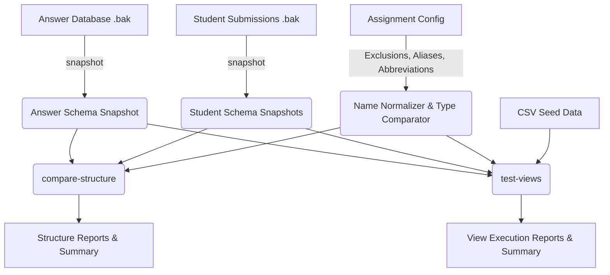

# Answer-Driven Grading Pipeline Verification Report

This report documents the transition of the database grading pipeline to a fully generic, answer-driven architecture. The pipeline now operates without domain-specific or exam-specific assumptions, relying strictly on the answer database snapshot as the source of truth.

---

## 1. Pipeline Architecture

The grading pipeline has been refactored to treat the answer database as the source of truth. Rather than assuming a hardcoded schema or set of expected tables/columns, all expectations are dynamically inferred during execution.



### 1.1 Answer Database as the Source of Truth
- **Schema Validation**: Expected tables, columns, data types, primary keys (PKs), and foreign keys (FKs) are retrieved directly from the schema snapshot of the answer database.
- **View Validation**: Under `views.mode: answer_snapshot` (default), the list of expected views is extracted dynamically from the answer database snapshot.
- **Data Seeding**: Seeding data into the temporary database is performed by resolving physical table structures and matching them against CSV files dynamically.

### 1.2 The Role of Configuration vs. Snapshot
To keep the grader generic, responsibilities are clearly partitioned between the answer snapshot and the configuration:

| Feature / Responsibility | Source of Truth | Configuration Customization |
| :--- | :--- | :--- |
| **Expected Tables & Columns** | Answer Snapshot | Exclude staging/system tables via `schema.excluded_tables`. |
| **Primary/Foreign Keys** | Answer Snapshot | Key/constraint expectations are derived entirely from the snapshot. |
| **Expected Views** | Answer Snapshot / Config | Can override using `views.mode: explicit_config` to explicitly check subset. |
| **Abbreviation Mapping** | Configuration | Custom expansions configured in `schema.abbreviations` (e.g. `mh: MuaHang`). |
| **Alias Resolution** | Configuration | Define synonyms in `schema.aliases.tables` and `schema.aliases.columns`. |
| **Type Compatibility** | Configuration | Globally or table-scoped override via `schema.type_compatibility.identifier_columns`. |

---

## 2. Name Matching Precedence

Name matching (resolving student physical names to canonical answer names) follows a strict precedence to ensure abbreviations do not override explicit aliases:

1. **Exact Normalized Match**: Cleaned student name matches canonical answer name exactly.
2. **Configured Aliases**: Matches an alias explicitly defined in configuration.
3. **Configured Abbreviations**: Matches via configured abbreviation expansion (e.g. `mh` to `muahang`).
4. **Fuzzy Fallback**: Uses Levenshtein-based similarity matching (only if the string length is > 3 and above matching thresholds).

---

## 3. Verification & Execution Results

### 3.1 Unit Test Suite
The unit test suite has been updated to cover generic behavior (e.g. `test_generic_behavior.py`) and name matching precedence. All unit tests execute successfully:

```powershell
$env:PYTHONPATH="src"; pytest tests/unit/
# Outcome: 98 passed in 0.74s
```

### 3.2 CLI Validation Runs
The pipeline was validated on real student submissions using the generic Ca3 configuration:

1. **Snapshot Extraction**:
   Successfully restored the answer database and student backups, extracted schema profiles, and recorded the snapshots cleanly without any warnings or ambiguities.
2. **Structure Comparison**:
   Analyzed structural mappings (tables, columns, PKs, FKs, types) and saved detailed reports under `runs/run_answer_driven_test/submissions/<student_id>/reports/`.
3. **View Testing & Seeding**:
   Seeded CSV datasets topologically using the resolved mappings and tested the view outputs. The seeding and comparison pipeline completed with 100% success (2/2 submissions processed cleanly).

---

## 4. How to Run the Pipeline

Run the following commands sequentially from the project root directory:

### Step 1: Extract Snapshots
Restore databases temporarily and extract their metadata profiles:
```powershell
$env:PYTHONPATH="src"
python -m dbcheck.cli.main snapshot `
  --answer-bak solution/dapan.bak `
  --submissions exams `
  --run-dir runs/run_answer_driven_test `
  --config configs/assignment_purchase_payment_ca3.yaml
```

### Step 2: Compare Schema Structure
Grade database schema structures against the answer database snapshot:
```powershell
$env:PYTHONPATH="src"
python -m dbcheck.cli.main compare-structure `
  --run-dir runs/run_answer_driven_test `
  --config configs/assignment_purchase_payment_ca3.yaml
```

### Step 3: Test Views and Outputs
Seed data into database structures and execute/validate views:
```powershell
$env:PYTHONPATH="src"
python -m dbcheck.cli.main test-views `
  --run-dir runs/run_answer_driven_test `
  --test-data test_data `
  --config configs/assignment_purchase_payment_ca3.yaml
```
